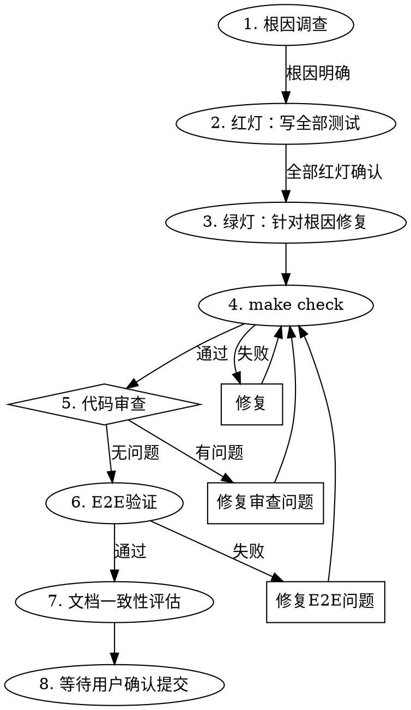

# Orbion Bug Fix Flow

## Overview

8步严格执行流程：根因调查→红灯写全部测试→绿灯针对根因修复→make check→代码审查→E2E验证→文档一致性评估→等待用户确认提交。

**修复必须针对根因，达到设计和测试目标。仅仅让测试变绿不是终点。**

## When to Use

- 用户报告 bug 并要求修复时
- 用户说"修复这个问题"或类似指令时
- E2E/集成测试发现失败需要修复时

**NOT use when:**
- 纯研究/探索任务（不写代码）
- 用户明确要求跳过某步
- 实施新功能（用 orbion-impl-plans）

## Core Workflow

## Severity Classification

| 严重度 | 定义 | 测试要求 |
|--------|------|----------|
| P0 | 核心流程断裂、数据丢失、安全漏洞 | 复现 + UT + 集成 + E2E |
| P1 | 重要功能异常，有 workaround | 复现 + UT + 集成 |
| P2 | 轻微问题，UI 文案、体验瑕疵 | 复现 + UT |

## Step Details

### 1. 根因调查

**REQUIRED SUB-SKILL:** 使用 `superpowers:systematic-debugging` Phase 1-3 执行根因调查。

**必须产出：**
- 根因描述
- 影响范围
- 严重度判定（P0/P1/P2）

**根因不明确则不进入步骤 2。**

### 2. 红灯：写全部测试

在修复之前，一次性写完所有对应层级的测试。

- **复现测试（必须）**：一个能稳定复现 bug 的失败测试
- **补充测试（按严重度）**：P0 +集成+E2E、P1 +集成、P2 只 UT

**规则：**
- 所有测试必须在未修复状态下失败（红灯确认）
- 测试要验证设计目标，不只是验证 bug 现象消失
- 复现测试是回归防护，修复后必须保留，不得删除

### 3. 绿灯：针对根因修复

> **铁律：修复必须针对根因，达到设计和测试目标。仅仅让测试变绿不是终点。**

- 从根因出发修复，不是从症状出发
- 修复后所有步骤 2 的测试必须通过
- 如果修复方式只是"绕过"了测试而非解决了根因，必须重新审视
- 判断标准：修复后，如果删掉任何一条测试，bug 是否仍被其他测试覆盖？如果不确定，说明修复可能只是凑测试通过
- 只写让测试通过的最小实现，不添加超出修复范围的代码

### 4. make check：全量验证

运行 `make check`（format + lint + type + type-front + test-all + test-front + audit），必须全部通过才能继续。

**如果失败：** 修复问题，重新 `make check`，直到通过。绝不跳过。

### 5. 代码审查循环

- 使用 `superpowers:requesting-code-review` dispatch code-reviewer agent
- 审查返回后，**所有 Critical 和 Important 级问题必须修复**
- 修复后重新 `make check`
- 再次审查直到无 Important 以上问题
- Minor 级问题征求用户意见是否修复

**绝不在审查问题未修复时进入下一步。**

### 6. E2E验证

- P0/P1 bug 必须跑 E2E
- P2 bug 由用户决定是否需要 E2E

**步骤：**
1. 启动基础设施：`make docker-up`
2. 启动 E2E 测试服务器：`python scripts/start-e2e-server.py`
3. 运行 E2E 测试：`make test-e2e`
4. 测试完成后关闭服务器和基础设施

**如果失败：** 修复问题，从步骤 4（make check）重新开始。绝不跳过。

### 7. 文档一致性评估

修复代码可能与设计文档产生偏差。提交前必须评估并同步文档。

**评估范围：**
1. **设计规格**（`docs/specs/`）：相关 API、组件职责、数据流是否受影响
2. **测试设计**：测试用例是否与实际测试代码一致

**流程：**
1. 对比修复变更与文档描述，列出偏差清单
2. 如果无偏差，直接进入下一步
3. 如果有偏差，向用户展示偏差清单和拟修改内容，等待确认
4. 用户确认后写入文档更新
5. 文档更新合入本次提交

**绝不带着已知文档偏差提交。**

### 8. 等待用户确认提交

- 展示变更摘要和审查结论
- **等待用户明确确认后才提交**
- commit message 一句话概括修复意图，控制在 70 字符以内
- 未经用户允许绝不自动提交

## 问题处理原则

**这三条是铁律，违反就是推卸责任：**

1. **谁发现谁负责**：不论是谁引入的，发现者追到底。测试失败、lint报错、类型检查错误——不管是不是本次修复引入的，发现时就必须修复。

2. **根因定位**：必须追到根因，不能只让测试变绿。不能只改测试让它通过、不能只加个 workaround 跳过报错、不能只改断言让它不检查那个 case。必须从根因层面修复。

3. **不推诿**：发现的问题即使不是本次修复引入，也必须确认根因。说"这不是我引入的所以不处理"是推卸责任。

## Red Flags — STOP

| 信号 | 正确做法 |
|------|---------|
| 直接改代码而不先调查根因 | STOP，回到步骤 1 |
| 修复只是加 try/except 吞掉异常 | 这是治标，找根因 |
| 测试通过了但修复逻辑"看着不对" | 质疑修复方式，重新审视根因 |
| 补充测试只验证 bug 现象消失 | 测试应验证设计目标是否达成 |
| 修改了与根因无关的代码 | 回退无关变更，只修根因 |
| 跳过红灯直接修复 | 必须先写复现测试 |
| 把 `# type: ignore` 或 lint 抑制加入代码 | 遵循项目规则，不自行添加抑制 |
| P0/P1 bug 跳过 E2E 验证 | P0/P1 必须跑 E2E |
| 修复后删除复现测试 | 复现测试是回归防护，必须保留 |
| 发现更深层的架构问题 | 记录问题，当前修复保持最小，架构问题另开任务 |
| 3+ 次修复仍失败 | STOP，质疑修复方向，可能根因判断有误 |

## Common Mistakes

1. **跳过根因调查直接修复** — 不运行 systematic-debugging 就写修复，可能治标不治本
2. **复现测试写完就删** — 复现测试是回归防护，修复后必须保留
3. **红灯不确认就写修复** — 写完测试必须运行确认失败，可能测试本身就有 bug
4. **修复超出最小范围** — 只修根因，不顺手"改进"无关代码
5. **P0/P1 跳过 E2E** — 严重度决定了测试层级要求，不能省略
6. **make check 只看测试忽略 lint** — check 是全量验证，不只因测试通过就跳过
7. **自行提交** — 无论多小的修复，都要用户确认
