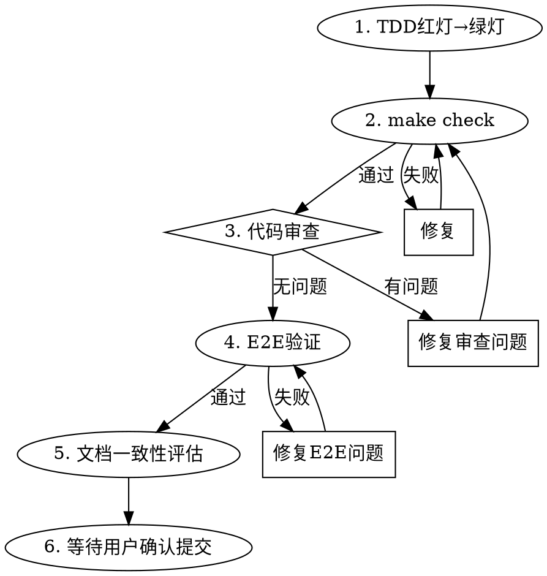

# Orbion Step Flow

## Overview

4步严格执行流程：TDD红灯→绿灯→make check→代码审查循环→E2E验证→文档一致性评估→等待用户确认提交。

**违反流程的字面规则就是违反流程的精神规则。**

## When to Use

- 实施 implementation plan 中的某个步骤时
- 用户说"实施步骤N"或类似指令时

**NOT use when:**
- 纯研究/探索任务（不写代码）
- 用户明确要求跳过某步

## Core Workflow

## Step Details

### 1. TDD红灯→绿灯

**REQUIRED SUB-SKILL:** 使用 `superpowers:test-driven-development` 执行完整的TDD流程。

补充约束：
- 从测试设计文档中提取当前步骤的全部TC用例
- 如果测试因缺少模块导入而无法运行（非逻辑失败），也算红灯通过
- 只写让测试通过的最小实现，不添加超出步骤增量范围的代码

### 2. make check：全量验证

运行 `make check`（format + lint + type + test-all + audit），必须全部通过才能继续。

**如果失败：** 修复问题，重新 `make check`，直到通过。绝不跳过。

### 3. 代码审查循环

- 使用 `superpowers:requesting-code-review` dispatch code-reviewer agent
- 审查返回后，**所有 Critical 和 Important 级问题必须修复**
- 修复后重新 `make check`
- 再次审查直到无 Important 以上问题
- Minor 级问题征求用户意见是否修复

**绝不在审查问题未修复时进入下一步。**

### 4. E2E验证

代码审查通过后，运行 Playwright E2E 测试验证端到端行为。

**步骤：**
1. 启动基础设施：`make docker-up`
2. 启动 E2E 测试服务器：`python scripts/start-e2e-server.py`
3. 运行 E2E 测试：`make test-e2e`
4. 测试完成后关闭服务器和基础设施

**如果失败：** 修复 E2E 测试或后端代码中的问题，重新从步骤 2 开始。绝不跳过。

**注意：** E2E 测试验证的是真实用户流程（浏览器→API→数据库→事件总线→SSE），这是 `make check` 中单元/集成测试无法覆盖的。

### 5. 文档一致性评估

实现代码可能与设计文档产生偏差（实现中发现设计遗漏、简化调整、API 签名变更等）。提交前必须评估并同步文档。

**评估范围：**
1. **设计规格**（`docs/specs/`）：API 端点、组件职责、数据流、错误处理是否与实现一致
2. **测试设计**（`docs/plans/*-test-design.md`）：测试用例是否与实际测试代码一致（名称、编号、检查项）
3. **实施计划**（`docs/plans/*-impl-plan.md`）：步骤增量描述是否与实际实现一致；依赖关系图是否需要更新

**流程：**
1. 对比当前步骤的实现变更与文档描述，列出偏差清单
2. 如果无偏差，直接进入下一步
3. 如果有偏差，向用户展示偏差清单和拟修改内容，等待确认
4. 用户确认后写入文档更新
5. 文档更新合入本次提交

**绝不带着已知文档偏差提交。**

### 6. 等待用户确认提交

- 更新实施计划文档：将当前步骤的 `- [ ]` 改为 `- [x]`
- 展示变更摘要和审查结论
- **等待用户明确确认后才提交**
- commit message 使用计划中指定的消息
- 未经用户允许绝不自动提交

## 问题处理原则

**这两条是铁律，违反就是推卸责任：**

1. **问题归属：谁发现谁负责，不论是谁引入的。** 测试失败、lint报错、类型检查错误——不管是不是当前步骤的代码引起的，发现时就必须修复。说"这不是我引入的所以不处理"是推诿。当前步骤的提交必须让整个项目处于健康状态，不能带着已知问题往前走。

2. **根因定位：必须追到底，不能只让测试变绿。** 测试失败了，不能只改测试让它通过、不能只加个workaround跳过报错、不能只改断言让它不检查那个case。必须找到失败的根本原因（是代码bug？是数据状态？是架构缺陷？），从根因层面修复。"让测试变绿"≠"问题解决了"。

## Red Flags — STOP

| 信号 | 正确做法 |
|------|---------|
| "这步很简单不需要TDD" | 简单代码也会出错，执行TDD |
| "审查问题可以后面再修" | Important以上问题必须现在修 |
| "先提交再说" | 等用户确认后再提交 |
| "make check失败但测试通过了" | 修复lint/type/coverage问题，check必须全通过 |
| "Minor问题全部修完再提交" | 征求用户意见，不是全部都要修 |
| "我直接提交用户不会介意" | 提交前必须确认，无例外 |
| "E2E测试太慢跳过吧" | E2E验证真实用户流程，必须通过 |
| "这不是我引入的问题" | 谁发现谁负责，必须修复 |
| "测试先绿了再说根因" | 先追根因再修复，不能只让测试变绿 |
| "加个skip/skipIf跳过失败测试" | 禁止屏蔽测试失败，必须定位根因并修复 |
| "计划状态更新不重要" | 计划状态反映进度，提交前必须更新 |
| "文档偏差以后再修" | 提交前必须评估并同步文档，保证文档与实现一致 |

## Common Mistakes

1. **跳过红灯验证** — 写完测试不运行确认失败，可能测试本身就有bug
2. **审查后遗留Important问题** — Important意味着"应该修复"，不是"可以遗留"
3. **make check只看测试忽略lint** — check是5项全通过，不是只看pytest
4. **自行提交** — 无论多小的变更，都要用户确认
5. **跳过E2E验证** — E2E测试验证真实用户流程，代码审查通过后必须运行
6. **推诿问题归属** — "不是我引入的所以不修"是推卸责任，谁发现谁负责
7. **只让测试变绿不追根因** — 改断言、加skip、加workaround都是逃避，必须定位根因再修复
8. **忘记更新计划状态** — 提交前必须将步骤checkbox改为已完成
9. **忽略文档偏差** — 实现与文档不一致时必须评估并同步，不能"以后再修"