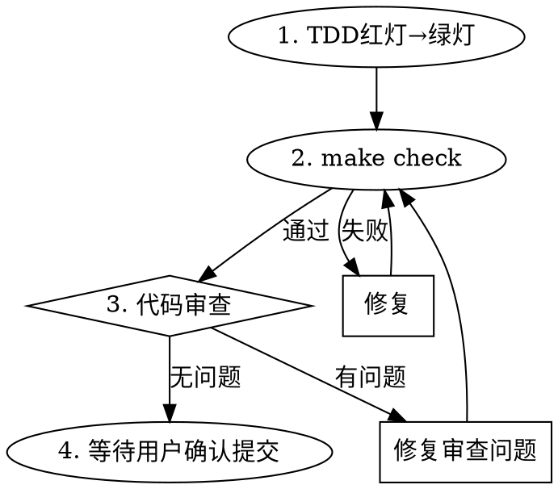

# Orbion Step Flow

## Overview

4步严格执行流程：TDD红灯→绿灯→make check→代码审查循环→等待用户确认提交。

**违反流程的字面规则就是违反流程的精神规则。**

## When to Use

- 实施 implementation plan 中的某个步骤时
- 用户说"实施步骤N"或类似指令时

**NOT use when:**
- 纯研究/探索任务（不写代码）
- 用户明确要求跳过某步

## Core Workflow

## Step Details

### 1. TDD红灯→绿灯

**REQUIRED SUB-SKILL:** 使用 `superpowers:test-driven-development` 执行完整的TDD流程。

补充约束：
- 从测试设计文档中提取当前步骤的全部TC用例
- 如果测试因缺少模块导入而无法运行（非逻辑失败），也算红灯通过
- 只写让测试通过的最小实现，不添加超出步骤增量范围的代码

### 2. make check：全量验证

运行 `make check`（format + lint + type + test-all + audit），必须全部通过才能继续。

**如果失败：** 修复问题，重新 `make check`，直到通过。绝不跳过。

### 3. 代码审查循环

- 使用 `superpowers:requesting-code-review` dispatch code-reviewer agent
- 审查返回后，**所有 Critical 和 Important 级问题必须修复**
- 修复后重新 `make check`
- 再次审查直到无 Important 以上问题
- Minor 级问题征求用户意见是否修复

**绝不在审查问题未修复时进入下一步。**

### 4. 等待用户确认提交

- 更新实施计划文档：将当前步骤的 `- [ ]` 改为 `- [x]`
- 展示变更摘要和审查结论
- **等待用户明确确认后才提交**
- commit message 使用计划中指定的消息
- 未经用户允许绝不自动提交

## Red Flags — STOP

| 信号 | 正确做法 |
|------|---------|
| "这步很简单不需要TDD" | 简单代码也会出错，执行TDD |
| "审查问题可以后面再修" | Important以上问题必须现在修 |
| "先提交再说" | 等用户确认后再提交 |
| "make check失败但测试通过了" | 修复lint/type/coverage问题，check必须全通过 |
| "Minor问题全部修完再提交" | 征求用户意见，不是全部都要修 |
| "我直接提交用户不会介意" | 提交前必须确认，无例外 |
| "计划状态更新不重要" | 计划状态反映进度，提交前必须更新 |

## Common Mistakes

1. **跳过红灯验证** — 写完测试不运行确认失败，可能测试本身就有bug
2. **审查后遗留Important问题** — Important意味着"应该修复"，不是"可以遗留"
3. **make check只看测试忽略lint** — check是5项全通过，不是只看pytest
4. **自行提交** — 无论多小的变更，都要用户确认
5. **忘记更新计划状态** — 提交前必须将步骤checkbox改为已完成