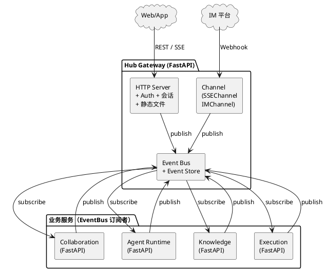
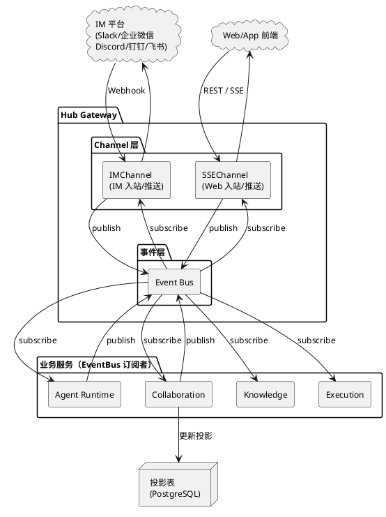

# Orbion — AI 协作开发平台设计规格

- [Orbion — AI 协作开发平台设计规格](#orbion--ai-协作开发平台设计规格)
  - [1. 平台定位与架构概述](#1-平台定位与架构概述)
    - [1.1 核心差异化](#11-核心差异化)
    - [1.2 目标用户](#12-目标用户)
    - [1.3 技术栈](#13-技术栈)
    - [1.4 架构原则](#14-架构原则)
  - [2. 系统架构与服务划分](#2-系统架构与服务划分)
    - [2.1 Hub Gateway](#21-hub-gateway)
    - [2.2 Collaboration Service](#22-collaboration-service)
    - [2.3 Agent Runtime Service](#23-agent-runtime-service)
    - [2.4 Knowledge Service](#24-knowledge-service)
    - [2.5 Execution Service](#25-execution-service)
  - [3. 核心概念模型](#3-核心概念模型)
    - [3.1 参与者](#31-参与者)
    - [3.2 核心事件类型](#32-核心事件类型)
    - [3.3 核心数据实体](#33-核心数据实体)
  - [4. Event Store \& CQRS](#4-event-store--cqrs)
    - [4.1 写端](#41-写端)
    - [4.2 读端](#42-读端)
    - [4.3 关键设计决策](#43-关键设计决策)
    - [4.4 信息分级存储](#44-信息分级存储)
  - [5. 知识库](#5-知识库)
    - [5.1 核心理念](#51-核心理念)
    - [5.2 4 种导航策略](#52-4-种导航策略)
    - [5.3 3 层注入策略](#53-3-层注入策略)
    - [5.4 知识库抽象接口](#54-知识库抽象接口)
    - [5.5 知识库与 Agent 记忆分离](#55-知识库与-agent-记忆分离)
  - [6. Agent 记忆](#6-agent-记忆)
    - [6.1 设计原则](#61-设计原则)
    - [6.2 记忆层次结构](#62-记忆层次结构)
    - [6.3 记忆三层映射](#63-记忆三层映射)
    - [6.4 经验记忆的工作方式](#64-经验记忆的工作方式)
    - [6.5 知识与记忆的交互规则](#65-知识与记忆的交互规则)
  - [7. Agent Runtime](#7-agent-runtime)
    - [7.1 Agent 注册声明](#71-agent-注册声明)
    - [7.2 Agent 生命周期](#72-agent-生命周期)
    - [7.3 模型适配层](#73-模型适配层)
    - [7.4 Agent 组装上下文的完整流程](#74-agent-组装上下文的完整流程)
  - [8. Agent Skills](#8-agent-skills)
    - [8.1 Skill 风险分级](#81-skill-风险分级)
    - [8.2 Skill 声明式注册](#82-skill-声明式注册)
    - [8.3 Skill 调用机制](#83-skill-调用机制)
    - [8.4 核心 Skills](#84-核心-skills)
  - [9. 权限模型](#9-权限模型)
    - [9.1 三层覆盖架构](#91-三层覆盖架构)
    - [9.2 核心安全规则](#92-核心安全规则)
  - [10. 前端设计](#10-前端设计)
    - [10.1 核心布局](#101-核心布局)
    - [10.2 前端技术栈](#102-前端技术栈)
    - [10.3 知识空间](#103-知识空间)
  - [11. Channel 接入设计](#11-channel-接入设计)
    - [11.1 核心概念](#111-核心概念)
    - [11.2 Channel 与 Event Bus 的关系](#112-channel-与-event-bus-的关系)
    - [11.3 ChannelConnection](#113-channelconnection)
    - [11.4 ChannelUserMapping](#114-channelusermapping)
  - [12. 部署模型](#12-部署模型)
  - [13. 渐进式路径](#13-渐进式路径)
    - [13.1 各阶段范围裁剪文档](#131-各阶段范围裁剪文档)
  - [14. 详细设计文档索引](#14-详细设计文档索引)
    - [14.1 架构](#141-架构)
    - [14.2 MVP](#142-mvp)
    - [14.3 Phase 2](#143-phase-2)

---

## 1. 平台定位与架构概述

Orbion 是一个**多人 + 多 Agent 双协作**的 AI 开发平台。核心模式：人类讨论达成共识 → AI 总结/分解/执行 → 人类审批产出。

### 1.1 核心差异化

- **人 + Agent 都是协作参与者** — 在同一事件系统中平等交互，只是 type 不同
- **审批式执行** — AI 产出内容和执行计划，人类审批后才实际执行
- **IM Channel 接入** — 事件驱动架构天然支持多通道，用户可在 Slack/企业微信等 IM 中直接参与讨论和审批
- **内置 Wiki 知识库** — Agent 通过 Context Injection 获取私域知识
- **私有化部署优先** — 架构设计支持未来 SaaS 迁移，不需全面重构

### 1.2 目标用户

开发团队和跨职能团队（均衡架构） — 代码协作和任务协作同等重要，AI 同时服务编码和非编码场景。

### 1.3 技术栈

- 前端：React + Vite（纯 SPA）+ TypeScript + TailwindCSS + shadcn/ui
- 后端：Python/FastAPI（Hub Gateway + 业务服务统一栈）
- 端侧：Web 优先

### 1.4 架构原则

- **所有服务间通信通过 Event Bus** — 无直接 HTTP 调用，人类和 Agent 通过事件系统平等协作
- **抽象接口先行** — ModelAdapter、KnowledgeRetriever、ChannelAdapter 等协议定义必须先行，实现可延后
- **Channel 统一抽象** — 所有外部入口（SSE、IM、未来新通道）统一为 ChannelPlugin，在 Hub Gateway 内共享同一套 Protocol 和事件映射，审批事件来自哪个通道对业务逻辑完全透明

---

## 2. 系统架构与服务划分

1 个基础设施枢纽（Hub Gateway）+ 4 个业务服务：



### 2.1 Hub Gateway

Hub Gateway 是所有外部入口的统一基础设施枢纽，管入站、鉴权、事件路由。业务逻辑不属于 Hub。

| 职责 | 说明 |
|------|------|
| HTTP Server + API 路由 | 所有 REST API 统一入口，CORS、限流、鉴权一处完成 |
| 认证 + 会话管理 | JWT 签发/验证、OAuth、SSE 连接管理 |
| 静态文件服务 | 内嵌 Vite SPA 前端构建产物，浏览器直连 Hub 无需额外 Node.js 进程 |
| Channel 管理 | 所有外部入口统一为 ChannelPlugin：SSEChannel（Web 推送）、IMChannel（Slack/企业微信等）、未来新通道 |
| Event Bus + Event Store | 事件路由中心 + 事件持久化（PostgreSQL） |

> Hub 与业务服务的分界线：**Hub 管入站和基础设施，业务逻辑留在业务服务**。审批状态机、Agent 调度与执行、知识库检索、Git 操作不属于 Hub。

### 2.2 Collaboration Service

EventBus 订阅者，不直接处理 HTTP 请求。

- 项目、成员（人类 + Agent）、角色权限管理
- 讨论线程创建、回复、归档
- 执行计划审批流状态机（proposed → reviewing → approved/rejected）
- 产出物审批流状态机
- 订阅协作相关事件，更新聚合视图，通过 EventBus 通知 Hub 推送前端

### 2.3 Agent Runtime Service

EventBus 订阅者，自行订阅事件并决定哪个 Agent 执行。

- Agent 注册中心：声明订阅的事件类型、使用的模型、能力标签
- Agent 生命周期：启动、暂停（checkpoint）、恢复、错误处理、Saga 补偿
- 模型适配层：Claude SDK 主接口 + OpenAI/Gemini/本地模型适配器
- 事件消费调度：自行订阅 EventBus，收到订阅事件后编排 Agent 执行流程
- Agent 产出发布：处理完成后发布新事件到 Event Bus
- Agent 工具扩展协议：Agent 通过声明式 Skill 注册能力

### 2.4 Knowledge Service

EventBus 订阅者。

- Wiki 文档 CRUD：Markdown 编辑、双向链接解析、图谱构建
- 标签系统、回链计算
- Context Injection 检索（通过 KnowledgeRetriever 抽象接口）
- 知识库接口与 Agent 记忆完全分离

### 2.5 Execution Service

纯 EventBus 订阅者。

- 代码/文档产出管理
- Git 集成：审批通过后自动 commit/push
- 产出物版本管理：保留每次迭代版本，可回溯
- 产出物预览：代码 diff 视图、文档渲染

---

## 3. 核心概念模型

### 3.1 参与者

统一人类和 Agent 为同一概念（Participant），在同一事件系统中平等交互，只是 type 不同。

```python
class Participant:
    id: str
    project_id: str
    type: "human" | "agent"
    display_name: str
    roles: bitmask  # 人类和 Agent 权限位空间
    # Agent 专属:
    model_config: ModelConfig
    subscribed_events: list[str]
    capabilities: list[str]
    skills: list[SkillDeclaration]
```

### 3.2 核心事件类型

| 事件 | 生产者 | 说明 |
|------|---------|------|
| DiscussionMessageCreated | 人类 | 讨论区发言 |
| DiscussionSummaryGenerated | 总结 Agent | 讨论摘要 + 共识点 |
| ExecutionPlanProposed | 分解 Agent | 任务分解计划 |
| ExecutionPlanApproved | 人类 | 审批执行计划 |
| ExecutionPlanRejected | 人类 | 拒绝 + 修改意见 |
| TaskOutputGenerated | 执行 Agent | 代码/文档产出 |
| TaskOutputApproved | 人类 | 审批产出 |
| TaskOutputRevisionRequested | 人类 | 要求修改 |
| KnowledgeBaseUpdated | 人类/Agent | 知识库文档变更 |
| KnowledgeQueryRequested | 人类/Agent | 知识库检索请求 |
| KnowledgeQueryResult | 知识 Agent | 检索结果 |
| AgentExperienceUpdated | Agent | Agent 经验记忆更新 |
| ChannelMessageReceived | ChannelAdapter | IM 通道收到用户消息（翻译为 DiscussionMessageCreated） |
| ChannelApprovalReceived | ChannelAdapter | IM 通道收到审批交互（翻译为 ExecutionPlanApproved/Rejected） |
| ChannelMessageSent | ChannelAdapter | Orbion 事件已翻译并推送到 IM |

> **注意**：Channel 中间事件翻译后映射到现有 Orbion 事件类型。业务模块只消费 Orbion 业务事件，不消费 Channel 中间事件。

### 3.3 核心数据实体

```
Project
  ├── id, name, description, settings, tenant_id

Participant (人类 + Agent 统一)
  ├── id, project_id, type, display_name, roles: bitmask

Thread (讨论线程)
  ├── id, project_id, title, status, type

Space (权限空间)
  ├── id, project_id, type, permission_overrides: json

Document (知识库文档)
  ├── id, project_id, title, content (Markdown)
  ├── outgoing_links, incoming_links, tags, agent_accessible: bool

ExecutionPlan
  ├── id, project_id, correlation_id, status, tasks[], proposed_by, approved_by

TaskOutput
  ├── id, execution_plan_id, task_id, type, content/diff, status, version

ChannelConnection (IM 通道连接)
  ├── id, project_id, channel_type, channel_id, config: json, enabled

ChannelUserMapping (IM 用户映射)
  ├── orbion_user_id, channel_type, channel_user_id, channel_user_name, verified_at
```

---

## 4. Event Store & CQRS

### 4.1 写端

CQRS 写端（Command Side），所有事件以不可变日志存储：

```python
class Event:
    event_id: uuid
    project_id: str          # 项目边界硬隔离
    event_type: str
    created_at: datetime
    participant_id: str      # 人类用户ID 或 Agent ID
    participant_type: "human" | "agent"
    payload: json
    correlation_id: uuid     # 跨事件追踪链（顶层字段，与 SQL 表结构一致）
    causation_id: uuid       # 触发此事件的上级事件ID（顶层字段，null 表示人类直接发起）
```

### 4.2 读端

CQRS 读端（Query Side），通过投影视图提供面向查询的数据结构：

| 投影视图 | 用途 | 更新触发 |
|----------|------|----------|
| thread_messages | 讨论线程消息列表 | DiscussionMessageCreated |
| execution_plans | 执行计划状态视图 | ExecutionPlanProposed/Approved/Rejected |
| task_outputs | 任务产出物视图 | TaskOutputGenerated/Approved/RevisionRequested |
| project_members | 项目成员视图 | 成员管理事件（定义见各阶段详细设计文档） |
| knowledge_graph | 文档间链接关系图 | KnowledgeBaseUpdated |

### 4.3 关键设计决策

- **存储引擎**：PostgreSQL（单表 event_log + 投影表）
- **信息分级存储**：4 级分级策略控制 event_log 容量增长（详见 4.4 节）
- **投影触发来源必须是已定义的事件类型** — 投影更新只能通过订阅 Event Bus 上的事件触发，不能使用非正式描述或绕过事件系统直接写入
- **correlation_id 串联完整链路** — "讨论 → 总结 → 分解 → 审批 → 执行" 同一个 ID
- **causation_id 记录因果** — 回溯 Agent 决策链
- **Projection → Prompt 模式** — 从事件流投影构建 Agent 的 LLM prompt 上下文

### 4.4 信息分级存储

不同类型的信息重要性不同，采用分级存储策略控制 event_log 容量增长：

| 级别 | 内容 | 特征 | 存储策略 |
|------|------|------|---------|
| **0 — 全量永久** | 人类输入（讨论消息、审批决定、知识库编辑）+ 元数据链（correlation_id/causation_id） | 不可替代、不可重生成，是真相来源 | event_log 全量 + 投影表双写，不可删除 |
| **1 — 全量 + 大 payload 外置** | Agent 最终产出（摘要、执行计划、代码 diff） | 可重生成但成本高 | event_log 存事件元数据，大 payload 存对象存储（本地文件系统或 S3），payload 字段放引用 ID |
| **2 — TTL 存储** | Agent 执行过程（LLM prompt/response、Skill 调用链、中间推理） | 调试和审计价值，不可替代性低 | 单独 agent_trace 表或对象存储，设 30-90 天 TTL；Agent checkpoint 只存状态快照 |
| **3 — 不进 event_log** | 系统操作（SSE 连接/断开、webhook 响应、session 管理） | 短期运维价值，长期无业务价值 | 只进结构化日志（logging 模块），不占 event_log |

> 核心原则：人类输入是真相来源，必须全量永久保留；Agent 过程信息参考业界做法（LangSmith TTL + LangGraph checkpoint 快照），不做全量永久存储。

---

## 5. 知识库

### 5.1 核心理念

Wiki 的双向链接、标签、层级结构本身就是知识图谱，直接序列化为结构化 prompt 注入 Agent 上下文。不需要向量检索管道。

### 5.2 4 种导航策略

| 策略 | 替代 RAG 的什么 | 说明 |
|------|----------------|------|
| 标签匹配 | 向量相似度检索 | 确定性、零误差 |
| 链接跳转 | 多跳推理 | 沿 `[[文档名]]` 跳转，天然多跳 |
| 层级导航 | 文档分块 | 文件夹/子文档是天然分块，整篇注入 |
| 回链聚合 | 相关文档推荐 | 谁引用了我 = 谁和我相关 |

### 5.3 3 层注入策略

- **核心层**（全量 60-70%）— 直接匹配标签/关键词的文档，完整内容注入
- **关联层**（摘要 20-25%）— 链接文档和回链文档，注入摘要
- **外围层**（索引 5-10%）— 二级链接文档，只注入标题和标签。Agent 可二次查询

### 5.4 知识库抽象接口

```python
class KnowledgeStore(Protocol):
    def create_document(project_id, doc: DocumentInput) -> Document
    def update_document(project_id, doc_id, content) -> Document
    def delete_document(project_id, doc_id) -> None
    def get_document(project_id, doc_id) -> Document
    def list_documents(project_id, filters) -> list[DocumentMeta]
    def resolve_links(project_id, content) -> list[str]
    def update_link_graph(project_id, doc_id) -> None

class KnowledgeRetriever(Protocol):
    def retrieve(project_id, query: KnowledgeQuery) -> KnowledgeContext

class KnowledgeQuery:
    project_id: str
    intent: str              # 查询意图
    tags: list[str]          # 目标标签
    seed_documents: list[str] # 起始文档 ID
    max_depth: int           # 跳转深度
    context_budget: int      # token 预算

class KnowledgeContext:
    core_documents: list[DocumentContent]      # 核心层全量
    related_summaries: list[DocumentSummary]   # 关联层摘要
    peripheral_index: list[DocumentMeta]       # 外围层索引
    graph_path: list[GraphHop]                # 检索路径（审计）
    total_tokens: int

class KnowledgeGraph(Protocol):
    def get_links(project_id, doc_id) -> list[str]
    def get_backlinks(project_id, doc_id) -> list[str]
    def get_neighbors(project_id, doc_id, depth) -> list[DocumentMeta]
    def get_shortest_path(project_id, from_doc, to_doc) -> list[str]
```

**接口与实现分离** — 当前用 Wiki 标签/链接导航实现 KnowledgeRetriever，未来可替换为向量检索或 GraphRAG 实现，不影响 Agent 代码。

### 5.5 知识库与 Agent 记忆分离

知识库管理私域知识（人类编写、长期维护、双向链接结构）。Agent 记忆管理 Agent 状态和行为偏好（机器生成、可重置、层次化 Markdown）。两者不混合存储。

---

## 6. Agent 记忆

### 6.1 设计原则

- 知识库与 Agent 记忆职责不同，不混合存储
- 知识库管理私域知识（人类编写、长期维护、双向链接），Agent 记忆管理行为状态（机器生成、可重置、层次化标题）
- 研究数据：分离存储准确率 +23%，幻觉率 -18%

### 6.2 记忆层次结构

所有层级统一用 `memory.md` 文件名，路径表达作用范围：

```
memory.md                                → 平台级（所有项目、所有Agent）
project/{id}/memory.md                   → 项目级（该项目所有Agent）
project/{id}/agents/{agent_type}/memory.md → Agent级（特定Agent类型）
```

加载顺序：平台 → 项目 → Agent，后加载覆盖前面的设置。

任务级记忆不做——链路上下文由 Event Store 按 correlation_id 提供，memory.md 只解决跨 correlation_id 的持久偏好。

### 6.3 记忆三层映射

借鉴 OpenClaw 的记忆分层思路，将三种记忆类型映射到 Orbion 实现：

| 记忆类型 | Orbion 实现 | 说明 |
|----------|------------|------|
| 工作记忆 | Event Store 事件流 | 当前 correlation_id 的上下文，执行完释放 |
| 项目记忆 | Wiki 知识库 | 通过 KnowledgeRetriever 按需注入 |
| 经验记忆 | 层次化 memory.md | Agent 行为偏好和执行经验，跨 correlation_id 持久化 |

### 6.4 经验记忆的工作方式

1. **执行前** — AgentScheduler 组装 prompt 时，加载对应层级的 memory.md
2. **执行后** — Agent 产出事件时，可附带 `experience_update`，更新 memory.md
3. **人类审查** — memory.md 受权限控制，Project Admin 可查看和修正
4. **跨项目** — 同类型 Agent 在不同项目有不同的 memory.md

### 6.5 知识与记忆的交互规则

- Agent 经验中提炼的通用规律 → 由 Project Admin 决定是否写入 Wiki（手动同步）
- Wiki 知识变更 → 不自动影响 Agent 记忆
- Agent 记忆可以重置 → 不影响 Wiki 数据

---

## 7. Agent Runtime

### 7.1 Agent 注册声明

借鉴 CrewAI 的 role/goal/backstory 三元组定义 Agent 身份：

```python
class AgentDeclaration:
    agent_id: str                    # Agent 实例唯一标识（注册时生成）
    agent_type: str                  # Agent 类型标识（summary/decompose/execute），同类型 Agent 共享声明模板
    display_name: str
    role: str                    # 能力角色描述
    goal: str                    # 目标描述
    backstory: str               # 行为约束（只定义边界，不定义知识）
    subscribed_events: list[str]
    output_event_type: str
    model_config: ModelConfig
    capabilities: list[str]
    skills: list[SkillDeclaration]
    max_concurrent_tasks: int
    requires_approval: bool      # 产出是否需要人类审批
    checkpoint_on_output: bool
```

### 7.2 Agent 生命周期

借鉴 LangGraph checkpoint 实现暂停/恢复机制：

```
注册 → IDLE → 收到事件 → RUNNING → 产出事件
                                    ↓ (requires_approval=True)
                              PAUSED → 等待审批 → RESUMED
                                    ↓ (失败)
                              ERROR → Saga 补偿
```

### 7.3 模型适配层

```python
class ModelAdapter(Protocol):
    def complete(prompt: PromptInput) -> ModelOutput

class PromptInput:
    system_prompt: str           # role + goal + backstory
    context: str                 # KnowledgeRetriever 注入的知识上下文
    memory: str                  # memory.md 加载的行为偏好
    task: str                    # 事件 payload 转化的任务描述
    history: list[EventSummary]  # 同 correlation_id 历史事件摘要

# 适配器实现：
# ClaudeAdapter (anthropic SDK) — 主接口
# OpenAIAdapter, GeminiAdapter, LocalModelAdapter (Ollama/vLLM)
```

### 7.4 Agent 组装上下文的完整流程

```
Agent 收到事件 → AgentScheduler.dispatch()
  → 1. AgentDeclaration 取 role/goal/backstory → system_prompt
  → 2. Event Store 取 correlation_id 历史 → history
  → 3. KnowledgeRetriever.retrieve(query) → context
  → 4. 加载 memory.md 层次链 → memory
  → 5. 事件 payload → task
  → 6. 合并为 PromptInput → ModelAdapter.complete()
  → 7. 解析 ModelOutput → 发布新事件
```

---

## 8. Agent Skills

借鉴 Claude Code "工具优于指令" + MCP 标准化扩展思路。Agent 的能力来自 Skill 组合，不靠 backstory 灌知识。

### 8.1 Skill 风险分级

| 风险级别 | Skills | 权限 |
|----------|--------|------|
| 低风险（自动允许） | knowledge.query, knowledge.read, project.history, project.members | Agent bitmask 有对应位 |
| 中风险（项目级权限） | knowledge.write, discussion.post, knowledge.navigate, agent.delegate | 空间级覆盖 allow |
| 高风险（必须审批） | code.generate, code.commit, approval.request, task.plan | Agent 产出后 PAUSED |

### 8.2 Skill 声明式注册

```python
class SkillDeclaration:
    name: str
    description: str
    input_schema: dict           # JSON Schema
    output_schema: dict
    risk_level: "low" | "medium" | "high"
    requires_approval: bool
```

### 8.3 Skill 调用机制

Agent 在 LLM 输出中用结构化 JSON 调用 Skill（借鉴 Hermes-2 function_call 格式）：

```json
{
  "skill_calls": [
    {"name": "knowledge.query", "arguments": {"tags": ["#认证"]}},
    {"name": "code.generate", "arguments": {"task_description": "..."}}
  ],
  "reasoning": "先查知识库再生成代码"
}
```

Agent Runtime 按声明顺序执行：低风险直接执行，高风险执行后 PAUSED。

### 8.4 核心 Skills

knowledge.query, knowledge.read, discussion.post, task.plan, code.generate, approval.request

---

## 9. 权限模型

### 9.1 三层覆盖架构

**第 1 层：项目基础权限**（借鉴 Discord Server + GitHub Org）

人类角色：

- Project Owner — 所有权限，管理成员和 Agent
- Project Admin — 管理设置、角色、审批策略
- Project Member — 讨论、审批、编辑知识库
- Project Viewer — 只可查看

Agent 角色：

- Agent Assistant — 订阅讨论事件、生成总结和计划
- Agent Executor — 订阅审批事件、生成代码/文档
- Agent Knowledge — 订阅知识事件、执行检索
- Agent Admin — 管理其他 Agent 配置（仅 Owner 可赋予）

**第 2 层：空间级覆盖**（借鉴 Discord Category Override）

讨论空间、知识空间、执行空间可覆盖项目基础权限，allow/deny 特定角色和 Agent。

**第 3 层：资源级覆盖**（借鉴 Discord Channel Override + ABAC）

单个线程、文档、执行计划可有独立权限。ABAC 上下文感知：执行计划涉及生产部署 → 要求 Admin 级审批。

### 9.2 核心安全规则

- **Deny 永远胜过 Allow** — 同层级冲突时 deny 生效
- **项目边界硬隔离** — 跨项目权限评估必须包含 project_id
- **Agent 默认最少权限** — 需要明确 allow 才获得更多能力
- **Bitmask 存储权限位** — 人类和 Agent 分开定义

---

## 10. 前端设计

### 10.1 核心布局

用户登录后直接进入工作区，无概览页面。

- **WorkspaceSidebar** — 左侧固定导航栏，图标按钮控制三栏显隐：导航/讨论/工作台
- **左栏：导航** — 项目→线程两层树形结构（带状态标记、未读提示、操作按钮）
- **中栏：讨论** — IM 泡泡风格消息流（自己右对齐蓝色、别人左对齐浅色、Agent 左对齐浅蓝+🤖图标），支持斜杠命令（/summarize、/help）
- **右栏：工作台** — 两 tab 面板：流程（按 task 状态分组聚合计划/产出/Agent 状态）、文件（VSCode 式文件浏览+编辑+Source Control，含 worktree 选择器）。详见 [工作台重构设计](../superpowers/specs/workspace-refactor-design.md)

线程是核心组织单元 — 选择线程，讨论和执行在同一视图。

### 10.2 前端技术栈

React + Vite（纯 SPA）+ TypeScript + TailwindCSS + shadcn/ui

- 编辑器：CodeMirror Markdown + [[文档名]] 自动补全
- Diff 视图：react-diff-viewer
- 实时更新：SSE 直连 Hub Gateway 推送

### 10.3 知识空间

暂不设计，后续根据需求独立设计。

---

## 11. Channel 接入设计

### 11.1 核心概念

Channel 是 Orbion 所有外部入口的统一抽象。SSE 推送和 IM 接入不是两个"并列的模块"，而是同一种 ChannelPlugin 的不同实现——SSEChannel 和 IMChannel，都在 Hub Gateway 内运行：

```
Web/App → SSEChannel → REST/SSE → Event Bus → Agent → Event Bus → SSEChannel → Web/App
Slack   → IMChannel  → Webhook  → Event Bus → Agent → Event Bus → IMChannel  → Slack API
企业微信 → IMChannel  → XML回调  → Event Bus → Agent → Event Bus → IMChannel  → 交互卡片
```

设计原则：

- **ChannelPlugin 统一抽象** — SSEChannel、IMChannel（SlackAdapter、WeChatEnterpriseAdapter 等）、未来新通道都实现同一套 ChannelAdapter Protocol，在 Hub 内共享同一套事件映射
- **业务代码只依赖抽象接口** — 不依赖具体通道 API，切换/新增 ChannelPlugin 时业务代码零改动
- **审批事件通道无关** — Event Bus 不关心事件来源通道，Web Approve 和 IM Approve 产生完全相同的事件
- **IM 做轻量交互，深度交互引导回 Web** — 讨论、审批、通知在 IM 完成；diff 预览、代码审查引导回 Web

### 11.2 Channel 与 Event Bus 的关系



> Hub Gateway 内分两层：Channel 层（翻译外部协议）和事件层（EventBus 路由）。投影更新由业务服务（Collaboration 等）订阅 EventBus 后自行执行，不属于 Hub。

双向消息流、审批流跨通道共享、消息格式翻译、线程映射等详细设计见 [2.2 Channel 设计](2.2-channel-design.md)。

### 11.3 ChannelConnection

每个项目可连接多个 IM 通道，每个通道有独立的配置（channel_type、channel_id、config JSON、enabled 状态）。详细数据模型和 SQL schema 见 [2.2 Channel 设计](2.2-channel-design.md)。

### 11.4 ChannelUserMapping

IM 用户 ID 与 Orbion 用户 ID 需要映射，映射方案随阶段演进（手动绑定 → OAuth → IM 优先注册）。详细数据模型、SQL schema 和映射方案对比见 [2.2 Channel 设计](2.2-channel-design.md)。

---

## 12. 部署模型

私有化部署优先，架构设计支持未来 SaaS 迁移：

- **数据模型带 tenant_id** — 私有化时只有一个租户，结构支持多租户
- **存储抽象化** — 接口层而非硬编码文件系统，后期可切换云存储
- **Hub Gateway 统一部署** — HTTP Server + Auth + Channel + EventBus + 静态文件服务合为一个 FastAPI 进程

---

## 13. 渐进式路径

- **简单优先** — MVP 只做 Prompt Chaining + Routing，不做复杂编排
- **抽象接口先行** — 定义 Protocol 和数据模型，实现可延后
- **渐进拆分** — 从单服务起步，按阶段拆分独立服务

### 13.1 各阶段范围裁剪文档

- Phase 1: [1.1 MVP 总体设计](1.1-mvp-overview.md)
- Phase 2: [2.1 Phase 2 总体设计](2.1-phase2-overview.md)

---

## 14. 详细设计文档索引

### 14.1 架构

| 文档 | 内容 | 对应章节 |
|------|------|---------|
| [术语表](0.2-glossary.md) | Orbion 专用术语定义 | 全文档 |
| [架构方案权衡与借鉴附录](0.3-arch-appendix.md) | 方案权衡、业界对比、知识库/记忆/权限方案分析 | — |

### 14.2 MVP

| 文档 | 内容 | 对应章节 |
|------|------|---------|
| [MVP 总体设计](1.1-mvp-overview.md) | 单服务架构、模块划分、依赖决策、范围裁剪 | 2, 3 |
| [事件基础设施](1.2-mvp-event-infrastructure.md) | EventBus Protocol、EventStore、CQRS、事件 payload | 4 |
| [数据模型](1.3-mvp-data-model.md) | PostgreSQL schema、Pydantic 模型、读写分离 | 3, 4 |
| [权限模型](1.4-mvp-permissions.md) | Bitmask 权限位、角色映射、权限计算 | 9 |
| [API 与认证](1.5-mvp-api-and-auth.md) | REST 端点、JWT 认证、SSE 推送 | 2, 3 |
| [Agent Runtime](1.6-mvp-agent-runtime.md) | Agent 定义、生命周期、ModelAdapter | 7, 8, 6 |
| [前端入口设计](1.7-mvp-ui-entry-design.md) | WorkspaceSidebar、三栏布局增强、Dialog、斜杠命令、产出操作 | 10 |
| [文件系统工作目录](1.8-mvp-file-layout.md) | 目录结构、配置映射、Agent 模板、部署映射 | — |
| [工作台文件编辑器](1.9-mvp-right-panel-editor.md) | 工作台 Tab 容器、FileTab、ActivityBar、Monaco 编辑器、Source Control | 10 |

### 14.3 Phase 2

| 文档 | 内容 | 对应章节 |
|------|------|---------|
| [Phase 2 总体设计](2.1-phase2-overview.md) | Phase 2 范围裁剪、服务拆分、IM Channel 渐进 | — |
| [Channel 设计](2.2-channel-design.md) | ChannelAdapter Protocol、数据模型、SQL Schema、平台适配 | 11 |

---
